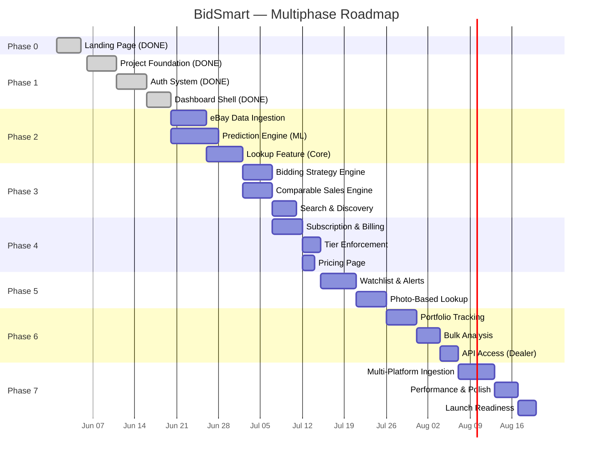

# BidSmart — Multiphase Implementation Plan

> Derived from [idea.md](file:///c:/projects/bidsmart/idea.md), [requirements.md](file:///c:/projects/bidsmart/requirements.md), and [tech_specification.md](file:///c:/projects/bidsmart/tech_specification.md)

---

## Phase Overview



---

## Phase Summary Matrix

| Phase | Name | Focus | Duration | Key Deliverables | Status |
|-------|------|-------|----------|-----------------|--------|
| **0** | **Landing Page** | Marketing & first impression | 1 week | Hero, value prop, sample prediction, pricing preview, waitlist CTA | ✅ Done |
| **1** | **Foundation & Auth** | Monorepo, infra, auth system, dashboard shell | 2 weeks | Project scaffold, DB schema, auth (email + Google OAuth), dashboard layout, deployment | ✅ Done |
| **2** | **Data & Predictions** | eBay ingestion, ML model, core lookup | 3 weeks | Data pipeline, price prediction model, link-based lookup feature | 🔜 Next |
| **3** | **Intelligence Layer** | Bidding strategy, comps, search | 2 weeks | Strategy engine, comparable sales, search & discovery |  |
| **4** | **Monetization** | Stripe integration, tier system, pricing | 1.5 weeks | Subscriptions, tier enforcement, pricing page |  |
| **5** | **Engagement** | Watchlist, alerts, photo lookup | 2 weeks | Watchlist with alerts, image-based item identification |  |
| **6** | **Dealer Tools** | Portfolio, bulk, API access | 2 weeks | Portfolio tracking, CSV batch analysis, dealer API |  |
| **7** | **Scale & Launch** | Multi-platform, polish, launch prep | 2 weeks | Heritage/LiveAuctioneers, performance tuning, production deploy |  |

**Total estimated duration: ~15 weeks** (Phase 1–7)

---

## Phase Dependencies

```mermaid
graph LR
    P0["Phase 0<br/>Landing Page<br/>✅ DONE"] --> P1["Phase 1<br/>Foundation & Auth<br/>✅ DONE"]
    P1 --> P2["Phase 2<br/>Data & Predictions<br/>🔜 NEXT"]
    P2 --> P3["Phase 3<br/>Intelligence Layer"]
    P3 --> P4["Phase 4<br/>Monetization"]
    P4 --> P5["Phase 5<br/>Engagement"]
    P5 --> P6["Phase 6<br/>Dealer Tools"]
    P6 --> P7["Phase 7<br/>Scale & Launch"]

    style P0 fill:#2d7a3a,stroke:#4ade80,color:#fff
    style P1 fill:#2d7a3a,stroke:#4ade80,color:#fff
    style P2 fill:#e67e22,stroke:#f39c12,color:#fff
    style P3 fill:#6c5ce7,stroke:#a29bfe,color:#fff
    style P4 fill:#6c5ce7,stroke:#a29bfe,color:#fff
    style P5 fill:#6c5ce7,stroke:#a29bfe,color:#fff
    style P6 fill:#6c5ce7,stroke:#a29bfe,color:#fff
    style P7 fill:#6c5ce7,stroke:#a29bfe,color:#fff
```



### Requirement Coverage by Phase

| Requirement Area | Phase | Coverage |
|-----------------|-------|----------|
| FR-AUTH (01–06) | Phase 1 | Full |
| FR-PRED (01–10) | Phase 2 + 5 | Link in P2, Photo in P5 |
| FR-COMP (01–06) | Phase 3 | Full |
| FR-STRAT (01–07) | Phase 3 + 4 | Basic in P3, Reseller in P4 |
| FR-WATCH (01–06) | Phase 5 | Full |
| FR-PORT (01–05) | Phase 6 | Full |
| FR-BULK (01–04) | Phase 6 | Full |
| FR-SEARCH (01–04) | Phase 3 | Full |
| FR-BILL (01–06) | Phase 4 | Full |
| SEC (01–14) | Phase 1 + 4 | Auth security in P1, billing security in P4, compliance in P7 |
| NFR-PERF (01–06) | Phase 7 | Performance tuning & validation |

---

## Phase 0 — Landing Page ✅ DONE

> **Status: Complete**

### What Was Delivered

| Deliverable | Description |
|-------------|-------------|
| **Hero Section** | Three.js particle scene, morphing blobs, wireframe torus knot, staggered text reveal |
| **Ticker** | Dual-direction CSS marquee with live predictions |
| **Stats** | 4 animated count-up stats (94%, 2.4M, $680, 12s) |
| **How It Works** | 3-step feature cards with GlassCard + Badge |
| **Product Preview** | Live Rolex Submariner prediction mockup with animated confidence bar |
| **Categories** | 12-category grid + 6 supported platforms |
| **Pricing** | Free ($0) vs Pro ($29/mo) comparison |
| **Testimonials** | 3 testimonial cards with scattered layout |
| **CTA / Waitlist** | Split emerald/burgundy background, Supabase email form |
| **Footer** | 3-column with product links, legal, socials |
| **Custom Cursor** | Dot + ring with lerp follow and hover scale-up |
| **Noise Overlay** | SVG fractalNoise at 3.5% opacity |

### Tech Delivered
- Next.js 13.5 project (App Router)
- Tailwind CSS with custom design system (obsidian/onyx/emerald/burgundy/champagne/ivory)
- Cormorant Garamond, Instrument Sans, JetBrains Mono typography
- Three.js hero scene with @react-three/fiber
- Framer Motion animations throughout
- shadcn/ui component library configured
- Vercel deployment configured
- Supabase integration for waitlist

---

## Phase 1 — Foundation & Auth

> **Duration: ~2 weeks** | **Goal: Buildable, authenticated app with dashboard shell**

### 1.1 Monorepo & Project Setup

| Task | Details | Files/Locations |
|------|---------|----------------|
| Initialize pnpm workspace | Configure `pnpm-workspace.yaml` with `apps/*` and `packages/*` | Root |
| Setup Turborepo | `turbo.json` with build, dev, lint, test pipelines | Root |
| Shared TypeScript config | Base `tsconfig.json` extended by all packages | `packages/config/` |
| Shared ESLint + Prettier | Common lint rules for frontend + backend | `packages/config/` |
| Shared types package | Entity interfaces, API types, enums, constants | `packages/shared/` |
| Environment config | `.env.example` with all required variables, `.env.local` for dev | Root, `apps/api/`, `apps/web/` |

#### Monorepo Structure Created

```
bidsmart/
├── apps/
│   ├── web/                    # Existing Next.js app (from Phase 0)
│   └── api/                    # NEW: Express.js backend
├── packages/
│   ├── shared/                 # NEW: Shared types & constants
│   └── config/                 # NEW: Shared configs
├── infrastructure/
│   └── docker/
│       └── docker-compose.yml  # NEW: Local dev stack
├── pnpm-workspace.yaml         # NEW
├── turbo.json                  # NEW
└── tsconfig.base.json          # NEW
```

---

### 1.2 Backend API Scaffold

| Task | Details |
|------|---------|
| Express.js server setup | Entry point, middleware stack, route mounting |
| Middleware implementation | CORS, Helmet, body parsing, request ID, structured logging (pino) |
| Error handling | `AppError` hierarchy, global error handler, async wrapper |
| Prisma ORM setup | `schema.prisma` with initial models (User, Subscription, RefreshToken) |
| Database migrations | Initial migration for auth-related tables |
| Docker Compose | PostgreSQL 16 (pgvector), Redis 7, Mailhog (email testing) |
| Health check endpoint | `GET /api/v1/health` returning service status |
| API versioning | All routes under `/api/v1/` prefix |

#### Files Created

```
apps/api/
├── src/
│   ├── index.ts                # Server entry + middleware
│   ├── routes/
│   │   ├── index.ts            # Route aggregator
│   │   ├── auth.routes.ts      # Auth endpoints
│   │   └── health.routes.ts    # Health check
│   ├── controllers/
│   │   └── auth.controller.ts
│   ├── services/
│   │   └── auth.service.ts
│   ├── middleware/
│   │   ├── authenticate.ts     # JWT verification
│   │   ├── rateLimiter.ts      # Redis sliding window
│   │   ├── errorHandler.ts     # Global error handler
│   │   └── requestId.ts        # UUID per request
│   ├── utils/
│   │   ├── errors.ts           # AppError, ValidationError, etc.
│   │   ├── logger.ts           # pino structured logger
│   │   └── jwt.ts              # Token generation/verification
│   └── validators/
│       └── auth.validators.ts  # Zod schemas
├── prisma/
│   ├── schema.prisma
│   └── migrations/
├── package.json
└── tsconfig.json
```

---

### 1.3 Authentication System

| Task | Requirement | Details |
|------|-------------|---------|
| Email/password registration | FR-AUTH-01 | Zod validation, bcrypt (cost=12), JWT generation |
| Login | FR-AUTH-02 | Credential verification, JWT + refresh token pair |
| Google OAuth | FR-AUTH-01 | `next-auth` or manual OAuth2 flow, user upsert |
| JWT middleware | SEC-01, SEC-02 | Verify bearer token, attach user to request |
| Refresh token rotation | SEC-02 | 30-day refresh tokens, single-use with rotation |
| Password reset | FR-AUTH-02 | Token-based reset via email (Resend) |
| Rate limiting on auth | SEC-04 | 5 login attempts/min per IP |

#### API Endpoints Implemented

| Method | Endpoint | Description |
|--------|----------|-------------|
| POST | `/api/v1/auth/register` | Register with email/password |
| POST | `/api/v1/auth/login` | Login, receive JWT + refresh token |
| POST | `/api/v1/auth/refresh` | Rotate refresh token, get new JWT |
| POST | `/api/v1/auth/logout` | Revoke refresh token |
| POST | `/api/v1/auth/forgot-password` | Send password reset email |
| POST | `/api/v1/auth/reset-password` | Reset password with token |
| POST | `/api/v1/auth/oauth/google` | Google OAuth callback |
| GET | `/api/v1/user/profile` | Get current user profile |
| PUT | `/api/v1/user/profile` | Update profile |

---

### 1.4 Frontend — Auth Pages & Dashboard Shell

| Task | Details |
|------|---------|
| Login page | Email/password form, Google OAuth button, "Forgot password" link |
| Registration page | Name, email, password form, Google OAuth, terms checkbox |
| Password reset pages | Request reset form, reset with token form |
| Auth state management | Zustand `authStore`, JWT in httpOnly cookie or localStorage |
| Protected route guard | `AuthGuard` component, redirect to `/login` if unauthenticated |
| Dashboard layout | Sidebar navigation, header with user menu, main content area |
| Dashboard page (empty state) | Welcome message, quick lookup input, placeholder cards |
| Settings page | Profile form (name, email, avatar), notification preferences |
| Mobile nav | Bottom navigation bar for mobile viewports |
| Theme toggle | Dark/light mode toggle persisted in localStorage |

#### Pages Created

| Route | Page | Access |
|-------|------|--------|
| `/login` | Login | Public |
| `/register` | Registration | Public |
| `/forgot-password` | Password reset request | Public |
| `/reset-password/[token]` | Password reset form | Public |
| `/dashboard` | Dashboard (empty shell) | Authenticated |
| `/settings` | Settings (profile & prefs) | Authenticated |

#### UI Components Created

| Component | Description |
|-----------|-------------|
| `Button` | Primary, secondary, ghost, danger, loading states |
| `Input` | Text, email, password, URL with validation states |
| `Card` | Glassmorphic card with variants |
| `Modal` | Dialog overlay with backdrop |
| `Toast` | Success/error/info notification popups |
| `Avatar` | User avatar with fallback initials |
| `Sidebar` | Collapsible navigation sidebar |
| `Header` | Top bar with logo, user menu, theme toggle |
| `MobileNav` | Bottom tab bar for mobile |
| `Skeleton` | Loading placeholder shapes |

---

### 1.5 Phase 1 — Verification

| Check | Method |
|-------|--------|
| Registration + login flow works end-to-end | Manual test |
| Google OAuth redirects and creates user | Manual test |
| JWT protects dashboard routes | Try accessing `/dashboard` while logged out |
| Refresh token rotation works | Wait for JWT expiry, verify auto-refresh |
| Password reset email sends (Mailhog) | Trigger reset, check Mailhog inbox |
| Dashboard renders with sidebar + header | Visual inspection on desktop + mobile |
| Docker Compose starts all services | `docker compose up` without errors |
| API health check passes | `GET /api/v1/health` returns 200 |
| Unit tests pass | `pnpm turbo test` |

---

## Phase 2 — Data & Predictions

> **Duration: ~3 weeks** | **Goal: eBay data pipeline + ML model + link-based lookup**

### 2.1 Database — Auction Data Schema

| Task | Details |
|------|---------|
| Extend Prisma schema | Add `AuctionRecord`, `Category`, `Lookup`, `Prediction`, `BiddingStrategy` models |
| Run migrations | Generate and apply SQL migrations |
| Seed categories | Insert initial categories (Watches, Trading Cards, Comics, Coins, Art, etc.) |
| Install pgvector extension | Enable `vector` extension for embedding storage |
| Create indexes | Full-text search (trgm), vector similarity (IVFFlat), composite unique on platform+platform_id |

---

### 2.2 eBay Data Ingestion Pipeline

| Task | Requirement | Details |
|------|-------------|---------|
| eBay API client | — | `EbayClient` class: OAuth token management, rate limiting, retry logic |
| Browse API integration | — | Fetch completed listings by category + date range |
| Data normalizer | — | Map eBay response → `AuctionRecord` schema |
| Deduplication | — | Upsert on `(platform, platform_id)` unique constraint |
| Ingestion worker | — | Bull queue job processor, runs every 6 hours |
| Embedding generation | — | Sentence-transformer embeddings for title + description |
| Elasticsearch sync | — | Index auction records in ES after ingestion |
| Ingestion monitoring | — | Log record counts, errors, duplicates per run |
| Initial data load | — | Backfill 50,000+ completed listings for Watches + Trading Cards |

#### Files Created

```
apps/api/src/
├── integrations/
│   └── ebay/
│       ├── EbayClient.ts       # API client with OAuth
│       ├── EbayNormalizer.ts    # Response → AuctionRecord mapping
│       └── ebay.types.ts       # eBay API type definitions
├── jobs/
│   ├── queues.ts               # Bull queue definitions
│   ├── ingestion.worker.ts     # Ingestion job processor
│   └── embedding.worker.ts     # Embedding generation worker
└── services/
    └── ingestion.service.ts    # Ingestion orchestration
```

---

### 2.3 ML Prediction Service

| Task | Details |
|------|---------|
| FastAPI service scaffold | Python project in `apps/ml/` with Dockerfile |
| Feature engineering module | Text features (TF-IDF), categorical encoding, temporal features, historical price stats |
| XGBoost price regressor | Train on completed auction data, target = sale_price |
| Quantile regression models | 10th and 90th percentile models for confidence intervals |
| Trend calculator | Compare avg sale price in last 30d vs. 90d prior → direction + percentage |
| Prediction API endpoint | `POST /predict` → `PredictionResponse` with low/mid/high/confidence/trend |
| Model evaluation | MAPE, R², MAE on holdout test set; target ≤ 15% MAPE |
| Model versioning | Version string in predictions, model artifacts stored in `/models/` |
| Health check | `GET /health` endpoint |
| Docker setup | Dockerfile for ML service, add to docker-compose |

#### Files Created

```
apps/ml/
├── api/
│   ├── main.py                 # FastAPI app
│   ├── routes/
│   │   └── predict.py          # Prediction endpoint
│   └── schemas/
│       └── prediction.py       # Request/response models
├── features/
│   ├── engineer.py             # Feature engineering pipeline
│   └── text.py                 # TF-IDF + embedding features
├── training/
│   ├── train_price_model.py    # XGBoost training script
│   ├── train_quantile.py       # Quantile regression training
│   └── evaluate.py             # Model evaluation metrics
├── models/                     # Trained model artifacts (.pkl)
├── data/                       # Sample data for testing
├── requirements.txt
├── Dockerfile
└── tests/
    └── test_predict.py
```

---

### 2.4 Core Lookup Feature (Link-Based)

| Task | Requirement | Details |
|------|-------------|---------|
| URL validation & platform detection | FR-PRED-01 | Parse URL → identify platform (eBay for MVP) |
| Item metadata extraction | FR-PRED-02 | Fetch item details via eBay API |
| Prediction integration | FR-PRED-03 | Call ML service with extracted features |
| Confidence interval display | FR-PRED-04 | Show low/mid/high with percentage |
| Trend indicator | FR-PRED-04 | Up/stable/down badge with % change |
| Store lookup + prediction | — | Save to `lookups` + `predictions` tables |
| Lookup count enforcement | FR-AUTH-05 | Decrement count, block when limit reached (free tier) |
| Lookup history | — | User can view past lookups on dashboard |
| Caching | NFR-PERF-01 | Cache lookup results in Redis (TTL: 1 hour) |
| Response time target | NFR-PERF-01 | < 5 seconds end-to-end |

#### API Endpoints Implemented

| Method | Endpoint | Description |
|--------|----------|-------------|
| POST | `/api/v1/lookup/url` | Submit listing URL, get prediction |
| GET | `/api/v1/lookup/:id` | Retrieve past lookup result |
| GET | `/api/v1/user/lookups/remaining` | Get remaining lookup count |

#### Frontend Pages & Components

| Page/Component | Description |
|----------------|-------------|
| **Dashboard** (updated) | Quick lookup input prominently placed, recent lookups list |
| **Lookup Result page** `/lookup/[id]` | Full prediction display with all data |
| `LookupInput` | URL paste field with platform auto-detection badge |
| `PredictionCard` | Price range gauge, confidence %, trend arrow |
| `ItemMetadata` | Extracted item details (title, condition, images) |
| `TrendBadge` | ↑ up / → stable / ↓ down with percentage |

---

### 2.5 Phase 2 — Verification

| Check | Method |
|-------|--------|
| Ingestion pipeline fetches eBay data | Run manual ingestion, verify records in DB |
| 50K+ auction records in database | Query count |
| Embeddings generated for all records | Check null embedding count |
| Elasticsearch index populated and searchable | Query ES directly |
| ML model trained, MAPE ≤ 15% | Check evaluation metrics |
| Prediction API returns results | `POST /predict` with sample features |
| Paste eBay URL → see prediction in UI | End-to-end manual test |
| Lookup count decrements for free user | Verify after lookup |
| Cached lookups serve faster on repeat | Time first vs. second request |
| All new tests pass | `pnpm turbo test` |

---

## Phase 3 — Intelligence Layer

> **Duration: ~2 weeks** | **Goal: Bidding strategy, comparable sales, search & discovery**

### 3.1 Bidding Strategy Engine

| Task | Requirement | Details |
|------|-------------|---------|
| Max bid calculator | FR-STRAT-01 | Based on predicted_mid, factor in market volatility |
| Walk-away price | FR-STRAT-03 | Upper bound above which ROI becomes negative |
| Timing advice | FR-STRAT-02 | Platform-specific (sniping for eBay) |
| Platform tactic generator | FR-STRAT-04 | Different strategies per platform's auction mechanics |
| Free vs Pro strategy | FR-STRAT-05 | Free: generic tip; Pro: full personalized strategy |
| Strategy storage | — | Save to `bidding_strategies` table alongside lookup |

#### Files Created/Modified

```
apps/api/src/services/
├── strategy.service.ts         # NEW: Strategy generation logic
└── lookup.service.ts           # MODIFIED: Include strategy in lookup response

apps/web/components/lookup/
└── StrategyPanel.tsx            # NEW: Max bid, timing, walk-away display
```

---

### 3.2 Comparable Sales Engine

| Task | Requirement | Details |
|------|-------------|---------|
| Vector similarity search | FR-COMP-06 | pgvector kNN search on embeddings |
| Attribute re-ranking | FR-COMP-06 | Boost for matching condition, platform, recency |
| Comparable display | FR-COMP-01, 02 | Show 5–10 results with title, price, date, thumbnail |
| Filter by time/condition/price | FR-COMP-03 | Pro+ feature — dynamic filtering |
| Price history chart | FR-COMP-04 | Interactive Recharts scatter plot with time range selector |
| Link to original listing | FR-COMP-05 | Open original eBay listing in new tab |

#### API Endpoints Implemented

| Method | Endpoint | Description |
|--------|----------|-------------|
| GET | `/api/v1/lookup/:id/comparables` | Get comparable sales with optional filters |
| GET | `/api/v1/lookup/:id/strategy` | Get bidding strategy for a lookup |

#### Frontend Components Created

| Component | Description |
|-----------|-------------|
| `ComparableGrid` | Grid layout of comparable sale cards |
| `ComparableCard` | Thumbnail, title, price, date, platform badge, similarity % |
| `PriceHistoryChart` | Recharts scatter plot with tooltips, time range filter |
| `ConfidenceGauge` | Visual gauge showing confidence level |

---

### 3.3 Search & Discovery

| Task | Requirement | Details |
|------|-------------|---------|
| Elasticsearch query integration | FR-SEARCH-01 | Full-text search with BM25, fuzzy matching |
| Search API endpoint | FR-SEARCH-01 | Keyword, category, price range, platform filters |
| Category browsing | FR-SEARCH-03 | Browse by category with icons and counts |
| Trending categories | FR-SEARCH-04 | Aggregate recent data → categories with rising avg prices |
| Autocomplete suggestions | — | Elasticsearch completion suggester |

#### API Endpoints Implemented

| Method | Endpoint | Description |
|--------|----------|-------------|
| GET | `/api/v1/search` | Search with query, filters, pagination |
| GET | `/api/v1/categories` | List all categories |
| GET | `/api/v1/trending` | Get trending categories (Pro+) |

#### Frontend Pages & Components

| Page/Component | Description |
|----------------|-------------|
| **Search page** `/search` | Search bar, filters panel, results grid |
| `SearchBar` | Input with autocomplete dropdown |
| `SearchFilters` | Category, platform, price range, time period filters |
| `SearchResults` | Card grid with predicted prices and trend badges |
| `TrendingCategories` | Horizontal card scroll of trending categories |

---

### 3.4 Phase 3 — Verification

| Check | Method |
|-------|--------|
| Strategy generated for each lookup | Verify strategy panel in lookup result |
| Comparables match item semantically | Visual inspection of top 10 results |
| Price history chart renders correctly | Visual inspection with real data |
| Free users see limited strategy | Login as free user, verify generic tip only |
| Search returns relevant results | Search for known items, check relevance |
| Filters narrow results correctly | Apply each filter, verify result changes |
| Trending categories reflect real data | Compare to manual DB aggregation |
| All endpoints return < 500ms (non-prediction) | Measure response times |

---

## Phase 4 — Monetization

> **Duration: ~1.5 weeks** | **Goal: Stripe subscriptions, tier enforcement, pricing page**

### 4.1 Stripe Integration

| Task | Requirement | Details |
|------|-------------|---------|
| Create Stripe products & prices | FR-BILL-01 | Pro Monthly/Annual, Dealer Monthly/Annual |
| Checkout session creation | FR-BILL-01 | Redirect to Stripe Checkout |
| Webhook handler | — | Signature verification, event processing |
| Handle `checkout.session.completed` | — | Create subscription record, upgrade user tier |
| Handle `invoice.paid` | — | Extend subscription period |
| Handle `invoice.payment_failed` | — | Mark `past_due`, send warning email |
| Handle `customer.subscription.deleted` | FR-BILL-03 | Downgrade to free tier |
| Prorated billing | FR-BILL-04 | Stripe handles proration automatically |
| Cancel subscription | FR-BILL-03 | Cancel at end of billing period |
| Receipt emails | FR-BILL-05 | Triggered by Stripe automatically + custom templates |
| Free trial | FR-BILL-06 | 7-day Pro trial, no credit card required |

#### API Endpoints Implemented

| Method | Endpoint | Description |
|--------|----------|-------------|
| POST | `/api/v1/subscription/checkout` | Create Stripe Checkout session |
| POST | `/api/v1/subscription/cancel` | Cancel subscription |
| GET | `/api/v1/subscription` | Get current subscription details |
| POST | `/api/v1/webhooks/stripe` | Handle Stripe webhook events |

---

### 4.2 Tier Enforcement

| Task | Requirement | Details |
|------|-------------|---------|
| RBAC middleware | SEC-03 | `requireTier('pro', 'dealer')` middleware |
| Lookup limit enforcement | FR-AUTH-05 | 5/month for free, unlimited for Pro/Dealer |
| Feature gating | FR-STRAT-05 | Free: basic prediction; Pro: full strategy, filters, watchlist |
| Rate limiting by tier | — | Free: 10 req/min, Pro: 60/min, Dealer: 200/min |
| Upgrade prompts | FR-AUTH-06 | Show remaining lookups, upgrade CTA when features are gated |
| Monthly lookup reset | FR-AUTH-05 | Cron job to reset `lookups_used` on billing cycle anniversary |

---

### 4.3 Pricing Page

| Task | Details |
|------|---------|
| Plan comparison table | Free vs Pro vs Dealer feature matrix |
| Interactive upgrade flow | Click "Upgrade" → Stripe Checkout → return to dashboard |
| Annual discount toggle | Switch between monthly and annual pricing |
| Current plan indicator | Highlight user's current plan |
| Subscription management in settings | Current plan card, cancel button, billing history |

#### Frontend Components Created/Modified

| Component | Description |
|-----------|-------------|
| `PricingTable` | 3-column plan comparison with feature checkmarks |
| `UpgradeModal` | Tier selection → Stripe redirect |
| `SubscriptionCard` | Current plan, next billing date, cancel option (Settings page) |
| `/pricing` page | Full pricing page (update from Phase 0 preview) |
| Dashboard header | Show remaining lookups badge for free users |

---

### 4.4 Phase 4 — Verification

| Check | Method |
|-------|--------|
| Stripe Checkout completes (test mode) | End-to-end with Stripe test cards |
| Webhook updates subscription and tier | Trigger Stripe events via CLI, check DB |
| Free → Pro upgrade unlocks features | Upgrade, verify watchlist/strategy access |
| Cancellation downgrades at period end | Cancel, verify access until period end |
| Free tier blocked after 5 lookups | Do 5 lookups, verify 6th is rejected |
| Rate limiting applies per tier | Load test with different tier users |
| Pricing page renders correctly | Visual inspection on desktop + mobile |
| Annual pricing toggle works | Verify correct prices display |

---

## Phase 5 — Engagement

> **Duration: ~2 weeks** | **Goal: Watchlist with alerts + photo-based lookup**

### 5.1 Watchlist & Alerts

| Task | Requirement | Details |
|------|-------------|---------|
| Add to watchlist | FR-WATCH-01 | Save lookup result to personal watchlist |
| Watchlist display | FR-WATCH-02 | Current bid, predicted price, time remaining, status |
| Cross-platform unified view | FR-WATCH-06 | All platforms in one list |
| Watchlist status updates | FR-WATCH-02 | Poll/webhook for auction end status (won, lost, ended) |
| Ending-soon alerts | FR-WATCH-03 | Email alert when watched item ends within 1 hour |
| New listing alerts | FR-WATCH-04 | Alert when new listing matches category below market value |
| Alert preferences | FR-WATCH-05 | Email/push toggle, quiet hours configuration |
| Alert job worker | — | Bull queue worker checking watchlist every minute |
| Email templates | — | React Email templates for each alert type |
| Resend integration | — | Transactional email delivery |

#### API Endpoints Implemented

| Method | Endpoint | Description |
|--------|----------|-------------|
| GET | `/api/v1/watchlist` | List watchlist items (cursor-paginated) |
| POST | `/api/v1/watchlist` | Add item to watchlist |
| DELETE | `/api/v1/watchlist/:id` | Remove item from watchlist |
| PUT | `/api/v1/user/profile` | Update notification preferences |

#### Frontend Pages & Components

| Page/Component | Description |
|----------------|-------------|
| **Watchlist page** `/watchlist` | Full watchlist with sorting, filtering, actions |
| `WatchlistTable` | Sortable table with status badges and countdown timers |
| `WatchlistRow` | Item thumbnail, predicted vs. current price, time remaining |
| `AddToWatchlist` | Button on lookup result page → adds to watchlist |
| Settings (updated) | Notification preferences section |

---

### 5.2 Photo-Based Lookup

| Task | Requirement | Details |
|------|-------------|---------|
| Image upload endpoint | FR-PRED-06 | Multipart form upload, validate MIME type + size (≤ 10MB) |
| Store image in S3/GCS | — | Upload to object storage, get permanent URL |
| Google Cloud Vision integration | FR-PRED-07 | Label detection, logo detection, OCR |
| Item classifier | FR-PRED-07 | Map Vision labels → BidSmart category + condition estimate |
| Photo → prediction pipeline | FR-PRED-06 | Identify item → generate features → predict price |
| Response time target | NFR-PERF-02 | < 10 seconds for photo-based lookups |
| DropZone component | — | Drag & drop or click-to-upload with preview |

#### API Endpoints Implemented

| Method | Endpoint | Description |
|--------|----------|-------------|
| POST | `/api/v1/lookup/image` | Upload image for identification + prediction |

#### Files Created

```
apps/api/src/integrations/
└── vision/
    ├── VisionClient.ts         # Google Cloud Vision API wrapper
    └── ItemClassifier.ts       # Map vision results → item identification

apps/web/components/
├── ui/
│   └── DropZone.tsx            # Image upload with drag & drop
└── lookup/
    └── LookupInput.tsx         # MODIFIED: Add photo upload tab
```

---

### 5.3 Phase 5 — Verification

| Check | Method |
|-------|--------|
| Add item to watchlist from lookup page | Manual test |
| Watchlist shows all saved items with correct data | Visual inspection |
| Remove item from watchlist | Click delete, verify removal |
| Ending-soon alert email received | Set up item ending soon, check Mailhog |
| New listing alert triggers | Ingest matching item below value, check alert |
| Alert preferences save and apply | Toggle settings, verify behavior |
| Photo upload identifies item correctly | Upload known item photos, check identification |
| Photo lookup returns prediction within 10s | Time the response |
| Invalid file types rejected | Try uploading PDF, verify error |
| Pro+ tier gate on photo upload | Try as free user, verify 403 |

---

## Phase 6 — Dealer Tools

> **Duration: ~2 weeks** | **Goal: Portfolio tracking, bulk analysis, API access**

### 6.1 Portfolio Tracking

| Task | Requirement | Details |
|------|-------------|---------|
| Add portfolio item | FR-PORT-01 | Manual entry or from past lookup |
| Current market value | FR-PORT-02 | Auto-calculate from comparable sales data |
| Total portfolio value + chart | FR-PORT-03 | Aggregate value, historical chart |
| Purchase price tracking | FR-PORT-04 | Record purchase price → show unrealized gain/loss |
| Auto-revaluation | FR-PORT-05 | Daily cron job updates `current_value` for all items |
| Portfolio value history | — | Daily snapshot stored in `portfolio_value_history` |

#### API Endpoints Implemented

| Method | Endpoint | Description |
|--------|----------|-------------|
| GET | `/api/v1/portfolio` | Get portfolio summary + items |
| POST | `/api/v1/portfolio` | Add item to portfolio |
| PUT | `/api/v1/portfolio/:id` | Update portfolio item |
| DELETE | `/api/v1/portfolio/:id` | Remove from portfolio |

#### Frontend Pages & Components

| Page/Component | Description |
|----------------|-------------|
| **Portfolio page** `/portfolio` | Dashboard with total value, chart, item grid |
| `PortfolioDashboard` | Total value card, gain/loss %, item count |
| `ValueChart` | Recharts line chart of portfolio value over time |
| `PortfolioItemCard` | Item with current value, purchase price, gain/loss |
| `AddPortfolioItem` | Modal form to add item manually or from lookup |

---

### 6.2 Bulk Analysis

| Task | Requirement | Details |
|------|-------------|---------|
| CSV upload endpoint | FR-BULK-01 | Parse CSV, validate columns, create bulk job |
| Async processing | FR-BULK-02 | Bull queue, process items sequentially |
| Progress tracking | FR-BULK-02 | Update `processed_items` count as job runs |
| Result generation | FR-BULK-03 | Generate CSV/PDF with predictions for each item |
| Download results | FR-BULK-03 | Store result file in S3, provide download URL |
| Completion notification | FR-BULK-02 | Email user when bulk job completes |

#### API Endpoints Implemented

| Method | Endpoint | Description |
|--------|----------|-------------|
| POST | `/api/v1/bulk/upload` | Upload CSV for batch analysis |
| GET | `/api/v1/bulk/:jobId` | Check job status + progress |
| GET | `/api/v1/bulk/:jobId/results` | Download result file |

#### Frontend Pages & Components

| Page/Component | Description |
|----------------|-------------|
| **Bulk page** `/bulk` | Upload area, job list with status indicators |
| CSV upload form | DropZone for CSV, column mapping preview |
| Job progress card | Progress bar, item count, estimated time |
| Download button | Download results when complete |

---

### 6.3 Dealer API Access

| Task | Requirement | Details |
|------|-------------|---------|
| API key generation | FR-BULK-04 | Generate hashed API keys for dealer accounts |
| API key management | — | List, create, revoke API keys in settings |
| API key authentication | SEC-09 | Accept `X-API-Key` header as alternative to JWT |
| Rate limiting per API key | — | 200 req/min per key |
| API documentation | — | Auto-generated from Zod schemas or manual Swagger/OpenAPI |

#### API Endpoints Implemented

| Method | Endpoint | Description |
|--------|----------|-------------|
| POST | `/api/v1/api-keys` | Generate new API key |
| GET | `/api/v1/api-keys` | List active API keys |
| DELETE | `/api/v1/api-keys/:id` | Revoke an API key |

#### Frontend (Settings Updated)

| Component | Description |
|-----------|-------------|
| API Keys section in Settings | List keys, create new, copy key, revoke |

---

### 6.4 Reseller Metrics (Strategy Enhancement)

| Task | Requirement | Details |
|------|-------------|---------|
| Platform fee calculator | FR-STRAT-06 | eBay final value fees (13.25%), shipping estimates |
| Tax estimation | FR-STRAT-06 | Basic sales tax by state/country |
| Net profit calculation | FR-STRAT-06 | `predicted_price - buy_price - fees - shipping - tax` |
| ROI percentage | FR-STRAT-07 | `net_profit / buy_price * 100` |
| Break-even price | FR-STRAT-07 | Price above which you lose money |
| Strategy panel update | — | Show reseller metrics for Dealer users |

---

### 6.5 Phase 6 — Verification

| Check | Method |
|-------|--------|
| Add item to portfolio, see current value | Manual test |
| Portfolio total value matches sum of items | Calculation check |
| Portfolio value chart shows historical data | Wait for 2+ daily snapshots, check chart |
| Gain/loss shown correctly with purchase price | Add item with known purchase price |
| CSV upload → bulk job processes correctly | Upload 10-item CSV, verify results |
| Bulk job progress updates in real-time | Watch progress bar during processing |
| Download bulk results as CSV | Click download, verify file contents |
| Generate API key, use for authenticated requests | Create key, make API call with `X-API-Key` |
| Revoke API key, verify it stops working | Revoke, retry, verify 401 |
| Reseller metrics appear for Dealer users | Check strategy panel as Dealer |
| All dealer features gated for non-dealer users | Login as Pro, verify 403 on portfolio/bulk/API |

---

## Phase 7 — Scale & Launch

> **Duration: ~2 weeks** | **Goal: Multi-platform, performance, production readiness**

### 7.1 Multi-Platform Data Ingestion

| Task | Details |
|------|---------|
| Heritage Auctions API client | Fetch completed lots for collectibles (coins, comics, art) |
| Heritage normalizer | Map Heritage response → AuctionRecord schema |
| LiveAuctioneers integration | Web scraping with Playwright/Puppeteer (polite: 1 req/2s) |
| LiveAuctioneers normalizer | Map scraped data → AuctionRecord schema |
| Multi-platform ingestion scheduler | Separate cron schedules per platform |
| Platform-specific strategy tuning | Adjust timing advice for Heritage (proxy bidding) vs. eBay (sniping) |
| Cross-platform search | Search results include all platforms with platform badges |

#### Files Created

```
apps/api/src/integrations/
├── heritage/
│   ├── HeritageClient.ts
│   └── HeritageNormalizer.ts
└── liveauctioneers/
    ├── LiveAuctioneersScraper.ts
    └── LiveAuctioneersNormalizer.ts
```

---

### 7.2 Performance Optimization

| Task | Target | Details |
|------|--------|---------|
| Frontend bundle optimization | ≤ 150 KB gzipped (JS) | Code splitting, tree shaking, dynamic imports |
| Image optimization | — | Next.js Image component, WebP, lazy loading |
| API response caching | — | Redis caching on all list/read endpoints |
| Database query optimization | ≤ 50ms p95 | Analyze slow queries, add missing indexes |
| Elasticsearch tuning | ≤ 100ms p95 | Shard configuration, query optimization |
| Connection pooling | — | Prisma connection pool sizing, Redis pool |
| Lighthouse audit | ≥ 90 performance score | Measure and iterate |
| Load testing | 1,000 concurrent users | Artillery/k6 load test on staging |

---

### 7.3 Compliance & Legal

| Task | Requirement | Details |
|------|-------------|---------|
| Terms of Service page | SEC-14 | Legal terms for platform use |
| Privacy Policy page | SEC-14 | GDPR/CCPA compliant privacy policy |
| Cookie consent banner | SEC-13 | Banner for EU users with opt-in/opt-out |
| Data export | SEC-11 | User can export all their data as JSON |
| Account deletion | SEC-11 | User can delete account + all data |
| HTTPS enforcement | SEC-06 | HSTS header, force HTTPS |
| CSP headers | — | Content Security Policy via next.config.js |

---

### 7.4 CI/CD & Production Deployment

| Task | Details |
|------|---------|
| GitHub Actions CI pipeline | Lint → typecheck → test (API/Web/ML) → build |
| Vercel production deployment | Frontend auto-deploy on merge to main |
| Railway/Render backend deployment | API + ML service containerized deployment |
| Supabase production database | PostgreSQL 16 with pgvector, daily backups |
| Upstash Redis production | Managed Redis with TLS |
| Elastic Cloud production | Managed Elasticsearch 8.x |
| AWS S3 production bucket | Image and file storage |
| Sentry production setup | Error tracking with source maps |
| Mixpanel events | Track key user actions (signup, lookup, upgrade, watchlist add) |
| Uptime monitoring | Configure uptime checks on critical endpoints |
| Domain & SSL | Custom domain, SSL certificate |

---

### 7.5 Monitoring & Observability

| Task | Details |
|------|---------|
| Structured logging (production) | Pino logs shipped to centralized log aggregator |
| Error alerting | Sentry alerts on error spikes |
| Performance monitoring | Sentry transaction tracking on key flows |
| Model performance dashboard | Track prediction accuracy on recent lookups |
| Queue monitoring | Bull Board UI for job queue health |
| Uptime dashboard | Public status page |

---

### 7.6 Pre-Launch Checklist

| # | Check | Status |
|---|-------|--------|
| 1 | All E2E tests pass on staging | ☐ |
| 2 | Stripe live mode configured and tested | ☐ |
| 3 | Production database migrated and seeded | ☐ |
| 4 | 50K+ auction records ingested from eBay | ☐ |
| 5 | ML model deployed with MAPE ≤ 15% | ☐ |
| 6 | Elasticsearch indexed and queryable | ☐ |
| 7 | Email delivery working (Resend live) | ☐ |
| 8 | HTTPS enforced with valid SSL | ☐ |
| 9 | CSP, CORS, HSTS headers configured | ☐ |
| 10 | Sentry capturing errors with source maps | ☐ |
| 11 | Mixpanel tracking key events | ☐ |
| 12 | Uptime monitoring active | ☐ |
| 13 | Terms of Service & Privacy Policy published | ☐ |
| 14 | Cookie consent working for EU users | ☐ |
| 15 | Lighthouse score ≥ 90 on all pages | ☐ |
| 16 | Load test passed (1,000 concurrent users) | ☐ |
| 17 | Backup & recovery tested | ☐ |
| 18 | Landing page updated with real CTAs (sign up, not waitlist) | ☐ |
| 19 | Onboarding email sequence configured | ☐ |
| 20 | README and internal docs updated | ☐ |

---

### 7.7 Phase 7 — Verification

| Check | Method |
|-------|--------|
| Heritage Auctions data ingests correctly | Run ingestion, check DB records |
| LiveAuctioneers data ingests correctly | Run scraper, check DB records |
| Cross-platform search works | Search, verify multi-platform results |
| Platform-specific strategies differ | Lookup eBay vs Heritage, compare strategy advice |
| Lighthouse ≥ 90 on all pages | Run Lighthouse CI |
| Load test: 1,000 concurrent users | Run Artillery/k6, check latency and errors |
| All 10 E2E scenarios pass | Run Playwright test suite |
| Stripe live transactions work | Process real $1 test charge |
| Error tracking captures real errors | Trigger error, verify in Sentry |
| Backup & restore procedure verified | Backup DB, restore to test instance, verify data |

---

## Post-Launch Roadmap (Future Phases)

These are not planned for initial launch but inform architecture decisions:

| Phase | Feature | Description | Estimated |
|-------|---------|-------------|-----------|
| **8** | Browser Extension | Chrome/Firefox extension overlaying predictions on auction pages | 4 weeks |
| **9** | Live Auction Copilot | Real-time bidding assistant during live auctions (WebSocket) | 6 weeks |
| **10** | Native Mobile App | React Native iOS/Android with camera-based valuation | 8 weeks |
| **11** | Catawiki + Sotheby's | European and high-end auction platform integrations | 4 weeks |
| **12** | Community & AI Chat | Anonymized market insights, natural language "Should I buy this?" interface | 6 weeks |

---

## Appendix: Tech Stack Per Phase

| Phase | Frontend | Backend | Database | ML | External APIs |
|-------|----------|---------|----------|----|----|
| **0** | Next.js, CSS tokens | — | — | — | — |
| **1** | + Auth pages, Dashboard shell, UI components | Express, Prisma, Pino | PostgreSQL, Redis | — | Google OAuth, Resend |
| **2** | + Lookup page, PredictionCard | + eBay client, Ingestion workers | + pgvector, Elasticsearch | FastAPI, XGBoost | eBay Browse API |
| **3** | + Strategy panel, Comps grid, Search, Charts | + Strategy service, Search service | (same) | (same) | (same) |
| **4** | + Pricing page, Upgrade modal | + Stripe webhooks, Tier middleware | + (same) | (same) | Stripe |
| **5** | + Watchlist page, DropZone | + Alert workers, Vision client | + S3/GCS | (same) | Google Vision |
| **6** | + Portfolio page, Bulk page, API keys | + Portfolio service, Bulk workers | + (same) | (same) | (same) |
| **7** | + Legal pages, Performance polish | + Heritage, LiveAuctioneers clients | + (same) | (same) | Heritage, LiveAuctioneers |

---

*This plan is a living document. Update as priorities shift and learnings emerge during development.*
